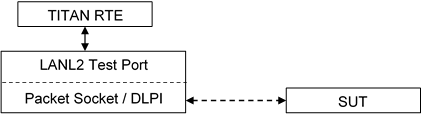

= LANL2 Test Port for TTCN-3 Toolset with TITAN, Description
:author: Gábor Szalai
:revnumber: 1551-CNL 113 519, Rev. A
:revdate: 2014-04-14
:toc:

= Functionality

The LANL2 test port makes it possible to execute test suites towards a SUT. It offers a connection between the SUT and the test suite.

The test port sends and receives Ethernet II frames with Packet Socket on Linux and with DLPI interface on Solaris (using DLIOCRAW mode).The capture filtering is done by Libpcap.

The communication between the LANL2 test port and the TITAN RTE is done by using the API functions described in <<_3, [3]>>. The Ethernet II frames are then transferred by the LANL2 test port to the SUT.

The test port translates the LANL2 ASPs and PDUs to Ethernet II frames when sending and translates the received packets to LANL2 ASPs.

See the most common Ethernet frame format below:

See Ethernet II frame format without CRC below:

[cols=",,,",options="header",]
|===========================================================
|6 bytes |6 bytes |2 bytes |46 to 1500 bytes
|DestinationMAC address |SourceMAC address |Ether Type |DATA
|===========================================================

== System Requirements

In order to operate the LANL2 test port the following system requirements must be satisfied:

* TITAN TTCN-3 Test Executor version R7A (1.7.pl0) or higher installed. For installation guide see <<_2, [2]>>.
* Platform:
** Linux version 2.2 or later, root privileges (for Packet Socket)
** Solaris 2.5, 2.6, 7, 8 or later, root privileges (for DLIOCRAW mode)
* The Libpcap library <<_6, [6]>> installed.

= Feature List

== Implementation

The test port implements the communication between the network packets and the TTCN-3 LANL2 ASPs and PDUs.

The test port is using Libpcap for capturing packets (see <<_5, [5]>>).

== Start Procedure

After the configuration is done correctly and the test port is mapped, it waits for incoming or outgoing messages.

The mapping procedure opens a socket for sending and a socket with Libpcap for reading. The capture filtering is also done here.

== Multi-Interface Support

The LANL2 test port can operate in single or multi interface mode. In single interface mode the used interface should be configured in the run time configuration file.

The multi interface mode the used interfaces should be opened via ASP messages.

== Open and Close Interfaces in Multi-Interface Mode

The network interface should be opened via `ASP_LANL2_open_interface` ASP. The used packet filter and default mac address can be set by the ASP.

The interface can be closed by the `ASP_LANL2_close_interface` message.

[[sending-receiving-lanl2-packets]]
== Sending/Receiving LANL2 Packets

=== Sending with LANL2 Test Port

The LANL2 test port is able to send two types of messages: PDU and ASP. The `PDU_LANL2` contains only the payload of the Ethernet packet and the addresses are taken from the configuration file. The `ASP_LANL2` contains all the information in order to send the Ethernet packet (the addresses are given in the test suite). In multi interface mode the `ASP_v2_LANL2` should be used.

The `PDU_LANL2` should be used when the MAC and/or IP addresses are not changing, they are fix, and can be set in the configuration file.

The `ASP_LANL2` should be used when the MAC and/or IP addresses need to be changed during the test execution.

[[sending-pdu-lanl2]]
==== Sending PDU_LANL2

The source and destination MAC address and the Ethernet type field is taken from the configuration file. The PDU contains only the user data (payload) of the Ethernet packet.

The LANL2 test port makes the Ethernet header from the test port parameters (source MAC address, destination MAC address, Ethernet type), and sends the packet.

[[sending-asp-lanl2]]
==== Sending ASP_LANL2

All Ethernet fields are taken from the ASP sent by the TITAN RTE. The user data is a `PDU_LANL2`, encapsulated in the ASP. When sending `ASP_LANL2`, no test port parameter has to be set according to the Ethernet packet (Ethernet II frame).

The LANL2 test port makes the Ethernet packet (header and payload) from the ASP and sends it.

=== Receiving with LANL2 Test Port

The LANL2 test port uses Libpcap for filtering the received packets. The filtering expression should be set in the configuration file. When expression is not set, all packets are captured.

The test port makes an `ASP_LANL2` or `ASP_v2_LAN2` from the received Ethernet packet, and sends it to TITAN RTE.

== Closing Down

By calling unmap the Test Port will close down the sockets towards the SUT and terminate.

The execution of the test suite can be stopped at any time by pressing `<Ctrl>-c`. Even when execution is interrupted with `<Ctrl>-c` the sockets are still closed.

== Logging

The type of information that will be logged can be categorized into two groups. The first one consists of information that shows the flow of the internal execution of the test port, for example, important events, which function that is currently executing etc. The second group deals with presenting valuable data, for example, presenting the content of a PDU. The logging printouts will be directed to the RTE log file. The user is able to decide whether logging is to take place or not by setting appropriate configuration data.

== Error Handling

Erroneous behavior detected during runtime is shown on the console and directed into the RTE log file. The following two types of messages are taken care of:

* Errors - information about errors is detected. If an error occurs the execution will stop immediately.
* Warnings - information about warnings is detected. The execution continues after the warning is shown.

== Limitations

Only Linux and Solaris platforms are supported.

=== Linux

The LANL2 test port uses Packet Socket for communication. Packet Socket is a new feature in Linux 2.2. This type of socket is implemented for Linux only (see <<_4, [4]>>). Root access is necessary for Packet Socket.

=== Solaris

The LANL2 test port uses the DLPI interface <<_6, [6]>> supported by the device driver, which provides the user-level applications with a direct channel to the link layer. This is accomplished by using the DLIOCRAW mode, supported in Solaris 2.5, 2.6, 7, 8 and later. Root access is necessary.

= Test Port Usage

== Module Structure

The LANL2 test port is implemented in the following TTCN-3 blocks:

* __LANL2asp_Types.ttcn__
* __LANL2asp_PortType.ttcn__

The file __LANL2asp_Types.ttcn__ defines the `PDU_LANL2` and `ASP_LANL2`. The port type is defined in __LANL2asp_PortType.ttcn__.

The C++ implementation of the test port is contained in the following files:

* __LANL2asp_PT.cc__
* __LANL2asp_PT.hh__

== Installation

Since the LANL2 test port is used as a part of the TTCN-3 test environment this requires TTCN-3 Test Executor to be installed before any operation of the LANL2 test port. For more details on the installation of TTCN-3 Test Executor see the relevant section of <<_2, [2]>>.

When building the executable test suite, the libraries compiled for the TTCN-3 Test Executor and the Libpcap library should also be linked into the executable. The Libpcap library shall be added to the _Makefile_ generated by the TITAN executor. See <<5-warning_messages.adoc#makefile, Makefile>> section of this document.

== Configuration

The executable test program behavior is determined via the run-time configuration file. This is a simple text file, which contains various sections (for example, `[TESTPORT_PARAMETERS]`) after each other. The usual suffix of configuration files is _.cfg_. For further information on the configuration file see Chapter 7 of <<_3, [3]>>.

=== LANL2 Test Port Parameters in the Test Port Configuration File

In the `[TESTPORT_PARAMETERS]` section the following parameters can be set for the LANL2 test port. The parameter names are case-sensitive.

* `eth_interface_name`
+
This parameter is mandatory. The parameter can be used to specify the name of the interface used for sending and receiving messages.

* `eth_mac_source`
+
This parameter is optional when sending `LANL2_PDU` and not used when sending `LANL2_ASP`. The parameter can be used to specify the source MAC address of the Ethernet II frame. If not set, the test port fills in the source MAC address from hardware (if possible).

* `eth_mac_destination`
+
This parameter is mandatory when sending `LANL2_PDU` and not used when sending `LANL2_ASP`. The parameter can be used to specify the destination MAC address of the Ethernet II frame.

* `eth_proto`
+
This parameter is mandatory when sending `LANL2_PDU` and not used when sending `LANL2_ASP`. The parameter can be used to specify which protocol is being transported in the Ethernet II frame.

* `packet_filter`
+
This parameter is optional but should be set according to the specific usage. The user can specify here a Libpcap filter expression. The receiving of the packets will be filtered according to the expression. The format is exactly the same as the filter used by tcpdump <<_5, [5]>>. If not set, every packet will be transmitted.

* `promiscuous_mode`
+
This parameter is optional. If set to `_"1"_`, the interface given by `eth_interface_name` will be set to promiscuous mode. Otherwise not. In promiscuous mode, network card passes all traffic it receives rather than just packets addressed to it.
+
NOTE: Even if this parameter is not `_"1"_`, the interface could well be in promiscuous mode for some other reason.

* `dump_erroneous_frame`
+
This parameter is optional. If set to `_"1"_`, when receiving an Ethernet packet smaller than 60 bytes (without CRC) but bigger than 14 bytes the event is logged as warning with the packet size given, and the packet dumped.

* `port_mode`
+
This parameter is optional. It controls the single or multi interface support of the test port. Possible values and behaviors:

** `_single_interface_` – The test port supports only one network interface. The interface is opened during the map operation. Usable messages: `ASP_LANL2`, `PDU_LANL2`, `ASP_LANL2_Error` (default)

** `_multiple_interface_` – The test port supports several network interfaces. Usable messages: `ASP_v2_LANL2`, `ASP_LANL2_open_interface`, `ASP_LANL2_close_interface`, `ASP_LANL2_open_result`, `ASP_v2_LANL2_Error`

* `error_mode`
+
This parameter is optional. It controls the behavior of the test port in the case of the error during send operation. Possible values and behaviors:

** `_error_` – The test port issues a TTCN error if the send failed. (default)

** `_warning_` – The test port logs a warning message if the send failed.

** `_ignore_` – The test port silently ignores the sending errors.

** `_report_` – The test port sends an error ASP to the test case.

* `pcap_timeout`
+
This parameter is optional. The parameter can be used to specify the read timeout of libpcap in milliseconds. If set to `_"0"_` (default) in some platforms, packets cannot be observed until sufficient number of packets has been arrived to fill the buffer.

= Error Messages

The error messages have the following general form:

[source]
Dynamic test case error: LANL2asp_PT(''<port name>'): <error text>

Error messages are written into the log file. In the log file a time stamp is also given before the message text.

The list of possible error messages is shown below. Note that this list contains the error messages produced by the test port. The error messages coming from the TITAN are not shown.

[[error-messages-in-case-of-sending-pdu-lanl2]]
== Error Messages In Case of Sending PDU_LANL2

`*Test port parameter 'eth_mac_destination' has to be set in config file.*`

The destination MAC address of an Ethernet II frame has to be set in the configuration file.

`*Test port parameter 'eth_proto' has to be set in config file.*`

The `EtherType` field of an Ethernet II frame has to be set in the configuration file.

`*Empty packet cannot be sent, PDU_LANL2 data has to be set.*`

The payload of the Ethernet II frame has to be set in 'PDU_LANL2`.

`*Length of 'PDU_LANL2 data' is not of correct size (expected: 46-<MTU>, given:* *<value> byte).*`

According to Ethernet data, the size of `PDU_LANL2` has to be `_46-1500_` bytes.

The standard MTU size is `_1500_`, but if the Jumbograms are supported it can be higher.

`*Cannot send packet on interface '<interface>'.*`

Sending the packet to network failed.

`*Sending error on interface '<interface>'. <value> bytes was sent instead of <value>.*`

The packet was sent unsuccessfully. Not the entire packet was sent.

[[error-messages-in-case-of-sending-asp-lanl2]]
== Error Messages In Case of Sending ASP_LANL2

`*Length of 'eth_src_addr' is not of correct size (expected: 6, given: <value> octets).*`

MAC addresses for Ethernet shell consist of 6 octets.

`*Unbound argument 'eth_dst_addr'. Destination MAC address has to be set in ASP_LANL2.*`

The destination MAC address of `ASP_LANL2` has to be given.

`*Length of 'eth_dst_addr' is not of correct size (expected: 6, given: <value> octets).*`

MAC addresses for Ethernet shell consist of 6 octets.

`*Unbound argument 'type_field'. Ethernet protocol type has to be set in ASP_LANL2.*`

The `EtherType` field of `ASP_LANL2` has to be given.

`*Length of 'type_field' is not of correct size (expected: 2, given: <value> octets).*`

The length of `EtherType` field shall be 2 octets. For example, `_"0800"_` is for IP.

`*Unbound argument 'payload'. Empty packet cannot be sent, payload has to be set.*`

The payload of the Ethernet II frame has to be set.

`*Length of 'payload' is not of correct size (expected: 46-<MTU>, given: <value> byte).*`

According to <<_4, [4]>>, the payload size of an Ethernet II frame has to be 46-<MTU> bytes. The standard MTU size is 1500, but if the Jumbograms are supported it can be higher.

`*Cannot send packet on interface '<interface>'.*`

Sending the packet to network failed.

`*Sending error on interface '<interface>'. <value> bytes was sent instead of <value>.*`

The packet was sent unsuccessfully. Not the entire packet was sent.

== Test Port Parameter Setting Error Messages

`*Parameter 'eth_interface_name' is an empty string. It has to be set in config file.*`

The name of the interface has to be set correctly in the configuration file.

`*Parameter 'eth_interface_name' is too long (expected: at most <value>, given: <value> characters).*`

The length of the interface name is not correct.

`*Parameter '<parameter>' is not of correct size (expected: <value>, given: <value> octets).*`

The length of the given parameter is not correct.

== Other Error Messages

`*Pcap can't receive.*`

An error occurred when capturing a packet with Libpcap.

`*Parameter 'eth_interface_name' must be set in config file.*`

The name of the interface has to be set in the configuration file.

`*Interface '<interface>' is down and cannot be set up.*`

The test port could not set up the given interface.

`*Cannot set up interface '%s'.*`

The test port could not set up the given interface.

`*Cannot open RAW socket on interface '<interface>'.*`

Some error occurred or no privileges for opening a RAW socket.

`*Cannot set broadcasting option for socket on interface ''%s'.*`

Some error occurred when setting socket options.

`*Cannot open socket on interface '<interface>' for reading with pcap.*`

Some error occurred when opening a socket for Libpcap.

`*Packet filter '<expression>' is not correct and cannot be compiled.*`

The given `<expression>` is not a correct packet filter expression. See <<_5, [5]>>.

`*Error setting packet filter.*`

Some error occurred when setting the filter for the pcap socket.

`*Cannot open socket.*`

Some error occurred when opening a socket.

`*Cannot get index of interface '<interface>'.*`

The test port could not get the index of the given interface.

`*Cannot get flags of interface '<interface>'.*`

The test port could not get the flags of the given interface.

`*Cannot set flags of interface '<interface>'.*`

The test port could not set the flags of the given interface.

`*Cannot get MAC address of interface '<interface>'.*`

The test port could not get the MAC address of the given interface.

= Warning Messages

`*Unsupported Test Port parameter: '<parameter>'.*`

The test port parameter `<parameter>` in the configuration file is not supported for the LANL2 test port.

`*Parameter 'packet_filter' is an empty string. All type of packets is received!*`

The filtering expression is empty in the configuration file. Every sent and received packet will be captured.

`*Parameter 'packet_filter' is not set. All type of packets is received.*`

No filtering expression is set in the configuration file. Every sent and received packet will be captured.

`*Interface '<interface>' was down, now it is set up and running.*`

The test port set up `<interface>` because it was down when starting.

`*Unbound argument 'eth_src_addr'. Source MAC address was not set in 'ASP_LANL2'. It is now set to '<value>' from HW.*`

The source MAC address was not set in the `ASP_LANL2`. The test port filled the field from the HW of the given interface.

`*Unbound argument 'eth_mac_source'. Source MAC was not set in config file. It is now set to '<value>' from HW.*`

The source MAC address was not set in the configuration file. The test port filled the field from the HW of the given interface.

`*Size of captured packet is not correct (expected: 14-1514 byte, received: <value>).*`

The size of the received packet is not a correct Ethernet II frame size. The packet is not sent to TITAN.

`*Erroneous packet (size of captured packet is not correct: <value> bytes).*`

If test port parameter `dump_erroneous_frame` is set true and the received packet is smaller than 60 bytes (without CRC) but bigger than 14 bytes the packet is dumped and sent to TITAN.

[[makefile]]
== Makefile

=== Linux

The `–lpcap` has to be added to `LINUX_LIBS` in order to use Libpcap.

[source]
LINUX_LIBS = -lpcap

= Terminology

*Sockets:* +
The socket is a method for communication between a client program and a server program in a network. A socket is defined as "the endpoint in a connection." Sockets are created and used with a set of programming requests or function calls sometimes called the sockets application-programming interface (API). The most common socket API is the Berkeley UNIX C language interface for sockets. Sockets can also be used for communication between processes within the same computer.

*Libpcap <<_5, [5]>>:* +
The Packet Capture library provides a high level interface to packet capture systems. All packets on the network, even those destined for other hosts, are accessible through this mechanism. Pcap is an application programming interface for packet capturing. The implementation of pcap for Unix-like systems is known as Libpcap.

*Packet sockets <<_4, [4]>>:* +
They are used to receive or send raw packets at the device driver (OSI Layer 2) level. Any packet sent through the socket will be directly passed to the Ethernet interface, and any packet received through the interface will be directly passed to the application. The Packet Socket is implemented in the Linux kernel.

*DLPI <<_6, [6]>>:* +
Data Link Provider Interface V2 enables a data link service user to access and use any of a variety of conforming data link service providers without special knowledge of the provider's protocol.

== Abbreviations

API:: Application Programming Interface

ASP:: Abstract Service Primitive

PDU:: Protocol Data Unit

RTE:: Run-Time Environment

SUT:: System Under Test

TTCN-3:: Testing and Test Control Notation version 3

= References

[[_1]]
[1] ETSI ES 201 873-1 v4.3.1 (2011-06) +
The Testing and Test Control Notation version 3. Part 1: Core Language

[[_2]]
[2] User Guide for the TITAN TTCN-3 Test Executor

[[_3]]
[3] Programmer’s Technical Reference for TITAN TTCN–3 Test Executor

[[_4]]
[4] packet (7) Linux man page +
http://www.die.net/doc/linux/man/man7/packet.7.html

[[_5]]
[5] Libpcap library +
http://www.tcpdump.org

[[_6]]
[6] dlpi(7P) Solaris man page +
http://docs.sun.com/app/docs/doc/816-5177/6mbbc4g4s?a=view
